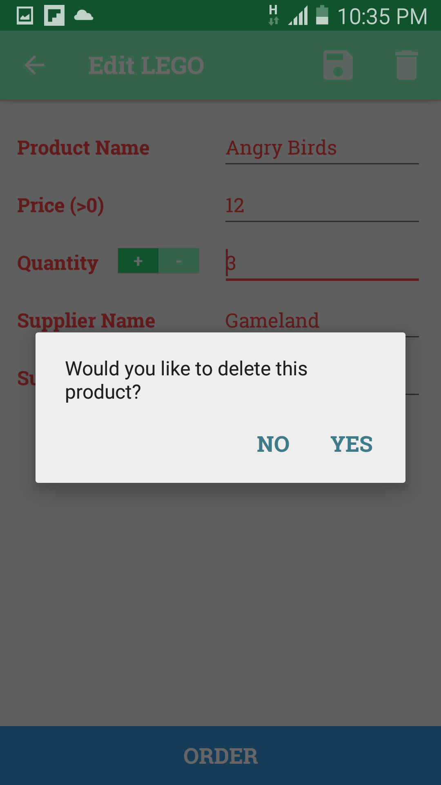

# Lego-Store

Inventory app that shows the details of Lego products and their availability.

This app will use a ContentProvider that access a SQLite database which is updated every time the details of the product change. 
Each product has a sale button that updates its quantity.

The user can add new products to the inventory, see product details, edit product details, and see all the inventory. 

Additionally, it is possible to delete a particular product or all the products at once from the database.

&nbsp;

&nbsp;

&nbsp;

&nbsp;

&nbsp;

&nbsp;

